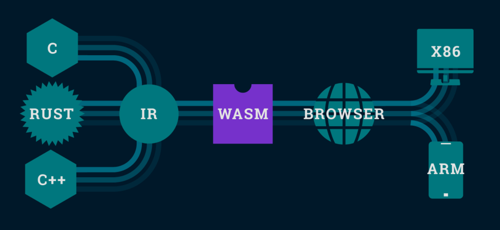

   

# Blazor and WebAssembly

This is a small side project to learn the concepts and possibilities of Blazor.

## What is it?

   

Blazor, developed by Microsoft, brings us the possibility of building web applications without the need of JavaScript, using only C#. With it, we can create SPA's (Single Page Applications) and PWA's (Progressive Web Applications). This is possible thanks to the WebAssembly (WASM): the code we write in C# (or, outside the .NET, in languages that also support this technology) is compiled to WASM, thus being able to run directly in the browser. This gives the application greater performance and smaller size, because we are dealing with binary instead of text.

   

## Interoperability with JS

Nor the emergence of the WebAssembly, nor of the Blazor mean the death of JavaScript on front-end, and there is no competitive relationship. With WASM, applications written in other languages can invoke JS methods, just like JavaScript can execute other languages' methods without using AJAX.

   

## Ways to use Blazor

Blazor is the project that compiles Microsoft's WASM, using C# as language and having two ways to be used:

| App                                 |
| ----------------------------------- |
| Client/Server (SignalR)             | 
| [WASM](Blazor/BlazorWebAssemblyApp) |